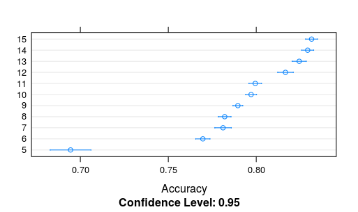
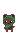

# Exercício 2 - Resultados e justificativas

Para efeito de comparação, foram treinados modelos dos seguintes métodos:
 * Random Forest (rf)
 * Support Vector Machine Radial (svmRadial)
 * Neural Network (nnet)

## Composição do algoritmo
O algoritmo é composto pelas seguintes partes:

1. Carregamento e construção dos dados
1. Treinamento, criação de predições de teste
1. Escolha e treinamento do melhor modelo de aprendizagem de máquina o SVM
1. Amostragem da matriz de confusão do modelo SVM 
1. Demonstração de treinamento e matriz de confusão do RandomForest

## Desenvolvimento

O projeto de treinamento começou erroneamente, por que no primeiro treinamento que eu fiz, ja foi com a base inteira, os dados do treinamento indicaram que o algoritmo RandomForest era mais efetivo de todos, desenvolvi toda a parte dele e no re-teste verifiquei o erro, com os dados atuais o SVM é muito mais eficiente, mostro detalhes dentro do "script_comentado", caso deseje executar separadamente as duas classificaçoes, existe arquivos respectivos


## Resultados obtidos


SVM: 
Com os dados certo não precisei mudar muito os dados para execução da predição final, alem dos informados pelo treino, a acuracia do modelo foi excelente como demonstrado abaixo
```
Confusion Matrix and Statistics

                     Reference
Prediction            red soil cotton crop grey soil damp grey soil
  red soil                1533           0         0              0
  cotton crop                0         703         0              0
  grey soil                  0           0      1354             36
  damp grey soil             0           0         4            583
  vegetation stubble         0           0         0              0
  very damp grey soil        0           0         0              7

Overall Statistics
                                          
               Accuracy : 0.991           
                 95% CI : (0.9884, 0.9931)
    No Information Rate : 0.2382          
    P-Value [Acc > NIR] : < 2.2e-16  
```

RandomForest:

Como ja peguei com um valor errado, a acuracia do meu treino ficou baixa

Overall Statistics
```
                                          
               Accuracy : 0.8244          
                 95% CI : (0.8149, 0.8336)
    No Information Rate : 0.2382          
    P-Value [Acc > NIR] : < 2.2e-16     
```

Isso me levou a tentar descobrir maneira de subir o nivel de acertibilidade do treino, pesquisando eu descobri que poderia utilizar o mtry que é fornecido pelo rf para fazer um loop de treinos descobrindo uma acuracia maior com o numero maximo de nodos

```
Accuracy 
        Min.   1st Qu.    Median      Mean   3rd Qu.      Max. NAs
5  0.6652565 0.6754617 0.6825479 0.6944459 0.7234043 0.7662547    0
6  0.7436693 0.7647674 0.7708881 0.7696537 0.7755532 0.7863924    0
7  0.7524064 0.7767246 0.7807571 0.7811341 0.7869110 0.8055848    0
8  0.7674919 0.7762201 0.7806925 0.7820712 0.7866805 0.8026667    0
9  0.7701863 0.7865821 0.7916010 0.7895641 0.7938808 0.8003136    0
10 0.7828150 0.7923157 0.7960596 0.7970769 0.8031496 0.8129610    0
11 0.7760085 0.7934272 0.8002109 0.7994534 0.8060797 0.8165962    0
12 0.7942089 0.8105428 0.8145034 0.8166253 0.8214286 0.8480211    0
13 0.8036093 0.8157472 0.8268514 0.8244462 0.8317659 0.8381503    0
14 0.8073248 0.8255069 0.8297985 0.8292505 0.8340448 0.8465637    0
15 0.8146214 0.8258811 0.8318445 0.8314741 0.8357181 0.8459916    0
```


Eu tentei utilizar as mesmas tecnicas para outros campos mas nao consegui ter exito.


## Conclusão

Tive um pouco de dificuldades para conseguir executar todos os códigos no meu computador devido um bug no linux com o kernlab e descobrir tipos de visualizaçoes de dados para matrizes de confusão


