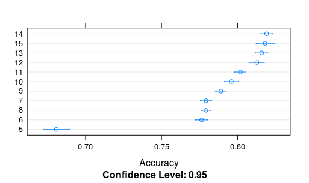

# Exercício 1 - Resultados e justificativas

Para efeito de comparação, foram treinados modelos dos seguintes métodos:
 * Random Forest (rf)
 * Support Vector Machine Radial (svmRadial)
 * Neural Network (nnet)

## Composição do algoritmo
O algoritmo é composto pelas seguintes partes:

1. Carregamento e construção dos dados
1. Treinamento, criação de predições de teste
1. Escolha e treinamento do melhor modelo de aprendizagem de máquina o SVM
1. Amostragem da matriz de confusão do modelo SVM 
1. Demonstração de treinamento e matriz de confusão do RandomForest

## Desenvolvimento

O projeto de treinamento começou erroneamente, por que no primeiro treinamento que eu fiz, ja foi com a base inteira, os dados do treinamento indicaram que o algoritmo RandomForest era mais efetivo de todos, desenvolvi toda a parte dele e no re-teste verifiquei o erro, com os dados atuais o SVM é muito mais eficiente, mostro detalhes dentro do "script_comentado", caso deseje executar separadamente as duas classificaçoes, existe arquivos respectivos


## Resultados obtidos


SVM: 
Com os dados certo não precisei mudar muito os dados para execução da predição final, alem dos informados pelo treino, a acuracia do modelo foi excelente como demonstrado abaixo
```
Confusion Matrix and Statistics

                     Reference
Prediction            red soil cotton crop grey soil damp grey soil
  red soil                1533           0         0              0
  cotton crop                0         703         0              0
  grey soil                  0           0      1354             34
  damp grey soil             0           0         4            586
  vegetation stubble         0           0         0              0
  very damp grey soil        0           0         0              6

Overall Statistics
                                          
               Accuracy : 0.9915          
                 95% CI : (0.9889, 0.9936)
    No Information Rate : 0.2382          
    P-Value [Acc NIR] : < 2.2e-16  
```

RandomForest:

Como ja peguei com um valor errado, a acuracia do meu treino ficou baixa

Overall Statistics
```
                                          
               Accuracy : 0.8489          
                 95% CI : (0.8281, 0.8681)
    No Information Rate : 0.2383          
    P-Value [Acc NIR] : < 2.2e-16     
```

Isso me levou a tentar descobrir maneira de subir o nivel de acertibilidade do treino, pesquisando eu descobri que poderia utilizar o mtry que é fornecido pelo rf para fazer um loop de treinos descobrindo uma acuracia maior com o numero maximo de nodos

```
Accuracy 
        Min.   1st Qu.    Median      Mean   3rd Qu.      Max. NAs
5  0.6612223 0.6709062 0.6781003 0.6808501 0.6816000 0.7694737    0
6  0.7567855 0.7686722 0.7764141 0.7763608 0.7840849 0.7958005    0
7  0.7621853 0.7723663 0.7797927 0.7792149 0.7831074 0.8034464    0
8  0.7637041 0.7738903 0.7784272 0.7792136 0.7852988 0.7899838    0
9  0.7763088 0.7841802 0.7867725 0.7890357 0.7931398 0.8082627    0
10 0.7777183 0.7879747 0.7958533 0.7958780 0.8025410 0.8272059    0
11 0.7847222 0.7953488 0.8007172 0.8017877 0.8075923 0.8203909    0
12 0.7869919 0.8048907 0.8163158 0.8126673 0.8240209 0.8287526    0
13 0.8023073 0.8090241 0.8141026 0.8159057 0.8226152 0.8397436    0
14 0.8027572 0.8137461 0.8183749 0.8190948 0.8280494 0.8339483    0
15 0.7858672 0.8090531 0.8178964 0.8181030 0.8275316 0.8499733    0
```


Eu tentei utilizar as mesmas tecnicas para outros campos mas nao consegui ter exito.

A validação acabou sendo pior que o teste inicial
```
Overall Statistics
                                         
               Accuracy : 0.8258         
                 95% CI : (0.8163, 0.835)
    No Information Rate : 0.2382         
    P-Value [Acc NIR] : < 2.2e-16 
```

Grafico de dados importantes tirados do RF


## Conclusão

Tive um pouco de dificuldades para conseguir executar todos os códigos no meu computador devido um bug no linux com o kernlab e descobrir tipos de visualizaçoes de dados para matrizes de confusão

!(./ewok.png)
E obrigado pela atenção - Desenho por @wolfaasowa]
